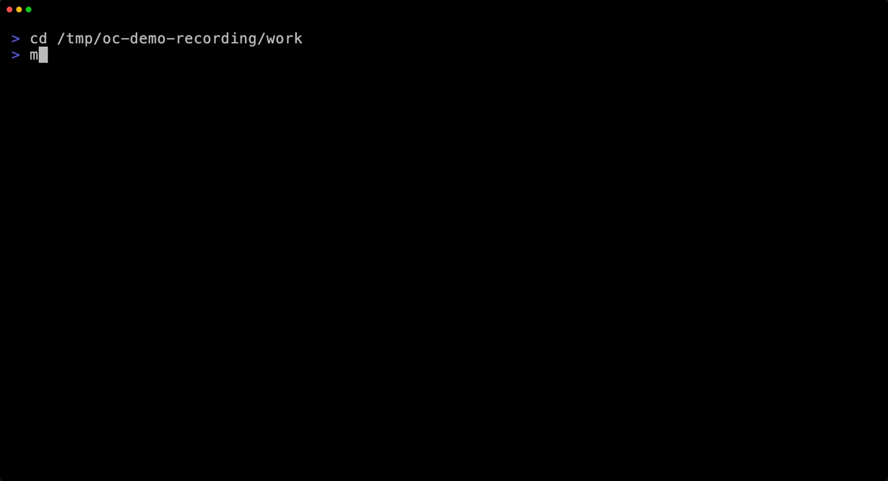

# OpenCode Config CLI

[](LICENSE)
[](https://github.com/sven1103-agent/opencode-config-cli/blob/main/go.mod)
[](https://github.com/sven1103-agent/opencode-config-cli/releases)
[](https://github.com/sven1103-agent/opencode-config-cli/actions/workflows/ci.yml)
[](https://github.com/sven1103-agent/opencode-config-cli/actions/workflows/e2e-cli.yml)

**Manage OpenCode configuration bundles and schema-validated multi-agent workflows**

## CLI Demo



Source tape: [docs/demo.tape](docs/demo.tape)  
Repeatable capture steps: [docs/demo-playbook.md](docs/demo-playbook.md)

## What is this?

A CLI tool (`oc`) that manages OpenCode [configuration bundles](docs/config-bundles.md) from external sources, enabling versioned, validated configs for AI agents.

## Quick Start (30 seconds)

```sh
# Install via Go (macOS/Linux)
go install github.com/sven1103-agent/opencode-config-cli@latest

# Create an alias to the default installation location
alias oc='$HOME/go/bin/opencode-config-cli'

# Register a config bundle
oc source add qbicsoftware/opencode-config-bundle --name qbic

# Apply a preset
oc bundle apply qbic --preset mixed --project-root .
```

## Installation

Detailed installation guide: [docs/installation.md](docs/installation.md)

Install methods:
- `go install` (recommended)
- Manual download from GitHub Releases

## Shell Completion

Enable tab completion for your shell:

```sh
# Bash: source on the fly, or install permanently
source <(oc completion bash)
oc completion bash | sudo tee /etc/bash_completion.d/oc > /dev/null

# Zsh: source on the fly (recommended)
source <(oc completion zsh)
# If you use alias (alias oc="opencode-config-cli"), also add:
compdef _oc opencode-config-cli

# Or save to completions dir:
# oc completion zsh > ~/.zsh/completions/_oc
# Add to ~/.zshrc: fpath=(~/.zsh/completions $fpath)
# Add: compdef _oc opencode-config-cli
# Clear cache: rm -f ~/.zcompdump && exec zsh

# Fish
oc completion fish > ~/.config/fish/completions/oc.fish
```

Run `oc completion --help` for full instructions.

## Key Concepts

| Concept | Description |
|---------|-------------|
| **Sources** | Registered bundle repositories (GitHub releases) |
| **Bundles** | Versioned, schema-validated OpenCode configs |
| **Presets** | Named configurations (e.g., `mixed`, `openai`) |

## Available Bundles

- [qbicsoftware/opencode-config-bundle](https://github.com/qbicsoftware/opencode-config-bundle) — Official bundle with multiple presets

## Documentation

| Guide | Description |
|-------|-------------|
| [docs/README.md](docs/README.md) | User documentation hub |
| [docs/installation.md](docs/installation.md) | Install on macOS/Linux |
| [docs/config-bundles.md](docs/config-bundles.md) | Understand bundles + create your own |
| [docs/demo-playbook.md](docs/demo-playbook.md) | Repeatable terminal demo script for README recordings |
| [docs/cli-reference.md](docs/cli-reference.md) | Full command reference |
| [docs/troubleshooting.md](docs/troubleshooting.md) | FAQ and common issues |

## Legacy (Bash Version)

The original Bash-based helper is deprecated. Use the Go CLI (`oc`) instead.

Archive documentation: [docs/legacy/bash-helper.md](docs/legacy/bash-helper.md)

---

## License

AGPL-3.0 — see the [LICENSE](LICENSE) file for details.
